# Aztec-Noir Proof Verification: Complete Code Explanation

## 🔍 Code Complexity Analysis

**Project Type**: Zero-Knowledge Proof Verification System
**Complexity Level**: Intermediate-Advanced
**Key Technologies**: Noir (ZK DSL), Aztec (Private Smart Contracts), Barretenberg (Proving System)

### Core Concepts Used:

- Zero-knowledge proofs (ZK-SNARKs)
- Private smart contract execution
- Cryptographic proof generation and verification
- Cross-system integration (off-chain proving → on-chain verification)

## 📊 Visual Architecture Diagram

### System Flow Visualization

```mermaid

flowchart TB
    subgraph "1. Circuit Definition"
        NC[Noir Circuit<br/>circuit/src/main.nr]
        NC -->|Proves x ≠ y| PROOF_LOGIC[Assertion Logic]
    end

    subgraph "2. Compilation Phase"
        NC -->|aztec-nargo compile| BYTECODE[Circuit Bytecode<br/>hello_circuit.json]
    end

    subgraph "3. Proof Generation"
        BYTECODE -->|Barretenberg| PROVER[UltraHonk Prover]
        INPUTS[Inputs: x=1, y=2] --> PROVER
        PROVER -->|Generates| PROOF_DATA[Proof Data<br/>- Proof: 508 fields<br/>- VK: 115 fields<br/>- Public inputs]
        PROOF_DATA -->|Saved to| JSON[data.json]
    end

    subgraph "4. Smart Contract"
        CONTRACT[ValueNotEqual Contract<br/>contract/src/main.nr]
        CONTRACT -->|Contains| VERIFY[verify_honk_proof]
        CONTRACT -->|Manages| STATE[Public Counter State]
    end

    subgraph "5. On-chain Verification"
        JSON -->|Submitted to| CONTRACT
        VERIFY -->|Verifies| RESULT{Valid?}
        RESULT -->|Yes| INCREMENT[Increment Counter]
        RESULT -->|No| FAIL[Transaction Reverts]
    end

    subgraph "6. Aztec Network"
        SANDBOX[Aztec Sandbox<br/>localhost:8080]
        PXE[Private Execution<br/>Environment]
        SANDBOX --> PXE
        CONTRACT -->|Deployed to| SANDBOX
    end

    style NC fill:#e1f5fe
    style CONTRACT fill:#c8e6c9
    style PROOF_DATA fill:#fff9c4
    style SANDBOX fill:#f3e5f5
```



### Data Flow Sequence

```mermaid
sequenceDiagram
    participant Dev as Developer
    participant Circuit as Noir Circuit
    participant BB as Barretenberg
    participant Contract as Aztec Contract
    participant Sandbox as Aztec Sandbox

    Dev->>Circuit: 1. Define proof logic (x ≠ y)
    Dev->>Circuit: 2. Compile circuit
    Circuit->>Circuit: Generate bytecode

    Dev->>BB: 3. Execute circuit with inputs
    BB->>BB: Generate UltraHonk proof
    BB->>Dev: Return proof, VK, public inputs

    Dev->>Contract: 4. Compile smart contract
    Dev->>Sandbox: 5. Start local network

    Dev->>Sandbox: 6. Deploy contract
    Sandbox-->>Dev: Contract address

    Dev->>Contract: 7. Call increment() with proof
    Contract->>Contract: Verify proof on-chain
    Contract->>Contract: Update private state
    Contract-->>Dev: Transaction success
```



## 🎓 Core Concepts Explained

### 1. Zero-Knowledge Proofs (Simple Analogy)

**Think of it like**: Proving you know a password without revealing the password itself.

**In this project**: The circuit proves that two numbers are different (x ≠ y) without revealing what x is. Only y is public.

```
Regular Proof:        "x is 1 and y is 2, so they're different"
Zero-Knowledge Proof: "I can prove x ≠ 2, but I won't tell you x"
```

### 2. Noir Circuit (The Proof Logic)

**File**: `circuit/src/main.nr`

```rust
fn main(x: Field, y: pub Field) {
    assert(x != y);  // This is the statement we're proving
}
```

**Key Points**:

- `x: Field` - Private input (hidden)
- `y: pub Field` - Public input (visible to everyone)
- `assert(x != y)` - The condition that must be true

**How it works**:

1. Prover knows both x and y
2. Prover generates proof that x ≠ y
3. Verifier only sees y and the proof
4. Verifier confirms the proof is valid without learning x

### 3. Aztec Smart Contract (The Verifier)

**File**: `contract/src/main.nr`

The contract has three main functions:

```rust
// 1. Initialize with a starting counter value and VK hash
fn constructor(headstart: Field, owner: AztecAddress, vk_hash: Field)

// 2. Verify proof (VK hash read from storage) and increment counter
fn increment(
    owner: AztecAddress,
    verification_key: [Field; 115],
    proof: [Field; 508],
    public_inputs: [Field; 1]
)

// 3. Read current counter value
fn get_counter(owner: AztecAddress) -> Field
```

### 4. UltraHonk Proving System

**What is it?** A high-performance proof generation system that creates compact, verifiable proofs.

**Size breakdown**:

- **Verification Key**: 115 field elements (~3.7KB)
- **Proof**: 508 field elements (~16.3KB)
- **Public Inputs**: 1 field element (the value of y)

## 📝 Step-by-Step Code Breakdown

### Step 1: Circuit Execution (`scripts/generate_data.ts`)

```typescript
// 1. Load the compiled circuit
const helloWorld = new Noir(circuitJson);

// 2. Execute circuit with specific inputs
const { witness } = await helloWorld.execute({
  x: 1, // Private: only prover knows
  y: 2, // Public: everyone can see
});

// 3. Generate the proof
const backend = new UltraHonkBackend(circuitJson.bytecode);
const proofData = await backend.generateProof(witness);

// 4. Extract verification key
const vk = await backend.getVerificationKey();

// 5. Convert to field elements for on-chain use
const proofAsFields = deflattenFields(new RawBuffer(proofData.proof));
const vkAsFields = await barretenbergAPI.acirVkAsFieldsUltraHonk(vk);
```

**What happens here**:

1. Circuit proves "1 ≠ 2" is true
2. Barretenberg creates cryptographic proof
3. Proof is serialized for blockchain storage

### Step 2: Contract Verification (`contract/src/main.nr`)

```rust
#[external("private")]
fn increment(
    owner: AztecAddress,
    verification_key: [Field; HONK_VK_SIZE],  // 115 elements
    proof: [Field; HONK_PROOF_SIZE],          // 508 elements
    public_inputs: [Field; 1],                // Just 'y' value
) {
    // Read VK hash from storage (stored during contract initialization)
    let vk_hash = self.storage.vk_hash.read();

    // This is the magic line - on-chain proof verification!
    verify_honk_proof(
        verification_key,
        proof,
        public_inputs,
        vk_hash   // VK hash for verification
    );

    // If proof is valid, enqueue public function to increment the counter
    self.enqueue_self._increment_public(owner);
}
```

### Step 3: Deployment & Interaction (`scripts/run_recursion.ts`)

```typescript
// 1. Connect to Aztec network and setup wallet
const aztecNode = await createAztecNodeClient("http://localhost:8080");
const testWallet = await TestWallet.create(aztecNode, config);

// 2. Deploy the contract with initial counter = 10 and VK hash
const contract = await ValueNotEqualContract.deploy(
  testWallet,
  10,                        // Initial counter value
  accounts[0].item,          // Owner address
  data.vkHash                // VK hash stored in contract
)
  .send(sendOpts)
  .deployed();

// 3. Submit proof for verification (VK hash read from storage)
const tx = await contract.methods
  .increment(
    accounts[0].item,
    data.vkAsFields,     // Verification key
    data.proofAsFields,  // The proof
    data.publicInputs    // Public input (y=2)
  )
  .send(sendOpts)
  .wait();

// 4. Check the counter increased
const counter = await contract.methods
  .get_counter(accounts[0].item)
  .simulate({ from: accounts[0].item });
// Counter is now 11 (10 + 1)
```
